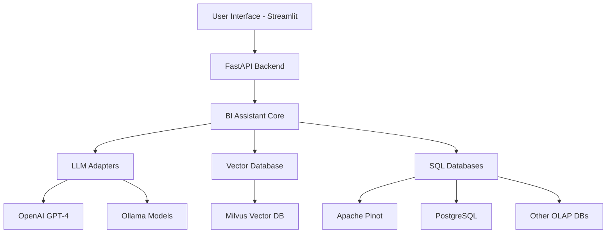

# 🔍 TextToSQL

[](https://www.python.org/downloads/)
[](https://fastapi.tiangolo.com/)
[](https://streamlit.io/)

A powerful multi-tenant BI Assistant that transforms natural language questions into accurate SQL queries and compelling visualizations. Built with modern AI/ML technologies and designed for enterprise-scale analytics.

## 📋 Table of Contents

- [✨ Features](#-features)
- [🏗️ Architecture](#️-architecture)
- [🔧 Prerequisites](#-prerequisites)
- [🚀 Quick Start](#-quick-start)
- [⚙️ Configuration](#️-configuration)
- [📖 Usage](#-usage)
- [🔌 API Documentation](#-api-documentation)
- [🎯 Examples](#-examples)
- [🛠️ Customization](#️-customization)
- [🐛 Troubleshooting](#-troubleshooting)
- [🤝 Contributing](#-contributing)

## ✨ Features

- **🧠 Natural Language Processing**: Converts complex business questions into accurate, tenant-scoped SQL queries
- **🗄️ Multi-Database Support**: Apache Pinot (MYSQL_ANSI dialect), PostgreSQL, and other OLAP/SQL backends
- **🚀 Real-time Streaming**: Live answers and visualizations through an intuitive Streamlit interface
- **🔧 Modular Architecture**: Extensible adapters for OpenAI, Ollama, Milvus vector database, and more
- **📊 Analytics Tracking**: Comprehensive conversation analytics and retrieval logging
- **🏢 Multi-tenant Support**: Secure tenant isolation and data access controls
- **📈 Interactive Visualizations**: Auto-generated charts and graphs from query results
- **🔍 Vector Search**: Smart retrieval of relevant schema information and SQL examples

## 🏗️ Architecture

TextToSQL follows a microservices architecture with clear separation of concerns:



### 📁 Project Structure

```
.
├── main.py                # 🚀 FastAPI backend entrypoint
├── streamlit_app.py       # 🌐 Streamlit frontend application
├── config.py              # ⚙️ Configuration classes for all services
├── requirements.txt       # 📦 Python dependencies
├── example.env            # 🔐 Environment variables template
├── src/                   # 📚 Core source code
│   ├── bi_assistant.py    #   🧠 Main BI assistant logic
│   ├── prompts.py         #   💬 General prompt templates
│   ├── pinot_prompts.py   #   📊 Pinot-specific prompts
│   ├── extra_pinot_prompts.py # 🔧 Additional Pinot prompts
│   ├── sql_prompts.py     #   🗃️ SQL-specific prompts
│   ├── types.py           #   📝 Type definitions and models
│   ├── utils.py           #   🛠️ Utility functions
│   ├── custom_exception.py #  ⚠️ Custom exception classes
│   ├── decorators.py      #   🎭 Function decorators
│   └── adapters/          #   🔌 External service adapters
├── data/                  # 📋 Sample data and examples
│   ├── sample_data/       #   📊 Sample datasets
│   └── SQLite.db          #   💾 Local analytics database
└── data_schemas/          # 📐 Database schema definitions
```

## 🔧 Prerequisites

Before setting up TextToSQL, ensure you have the following:

### System Requirements
- **Python**: 3.8 or higher
- **Memory**: Minimum 4GB RAM (8GB+ recommended)
- **Storage**: At least 2GB free space
- **OS**: Linux, macOS, or Windows

### Required Services
- **LLM Provider**: One of the following:
  - OpenAI API account with GPT-4 access
  - Ollama server with compatible models
- **Vector Database**: Milvus instance (optional but recommended)
- **SQL Database**: Apache Pinot, PostgreSQL, or compatible OLAP database

### Development Tools (Optional)
- Git for version control
- Docker for containerized deployment
- Virtual environment tool (venv, conda, etc.)

## 🚀 Quick Start

### 1. 📦 Installation

Clone the repository and install dependencies:

```bash
# Clone the repository
git clone https://github.com/abhishek-msh/TextToSQL.git
cd TextToSQL

# Create a virtual environment (recommended)
python -m venv venv
source venv/bin/activate  # On Windows: venv\Scripts\activate

# Install dependencies
pip install -r requirements.txt
```

### 2. 🔐 Environment Configuration

Create your environment configuration:

```bash
# Copy the example environment file
cp example.env .env

# Edit the .env file with your credentials
nano .env  # or use your preferred editor
```

**Required Environment Variables:**
```env
# OpenAI Configuration (if using OpenAI)
OPENAI_API_KEY=your_openai_api_key_here
OPENAI_ENDPOINT=https://api.openai.com/v1
CHATCOMPLETION_MODEL=gpt-4o

# Database Configuration
PINOT_SERVER=your_pinot_server_url
DB_PATH=data/SQLite.db

# Milvus Configuration (if using vector search)
MILVUS_HOST=your_milvus_host
MILVUS_COLLECTION_NAME=your_collection_name
```

### 3. 🚀 Starting the Services

#### Option A: Development Mode (Recommended for testing)

**Terminal 1 - Start the FastAPI Backend:**
```bash
uvicorn main:app --reload --host 0.0.0.0 --port 8083
```

**Terminal 2 - Start the Streamlit Frontend:**
```bash
streamlit run streamlit_app.py --server.port 8501
```

#### Option B: Production Mode
```bash
# Start backend
uvicorn main:app --host 0.0.0.0 --port 8083 --workers 4

# Start frontend (in another terminal)
streamlit run streamlit_app.py --server.port 8501 --server.address 0.0.0.0
```

### 4. 🌐 Access the Application

- **Frontend UI**: http://localhost:8501
- **API Documentation**: http://localhost:8083/docs
- **API Health Check**: http://localhost:8083/

## ⚙️ Configuration

TextToSQL supports extensive configuration through environment variables. Here's a comprehensive guide:

### 🤖 LLM Configuration

#### OpenAI Settings
```env
OPENAI_API_VERSION=2025-03-01-preview
OPENAI_API_KEY=your_api_key
OPENAI_ENDPOINT=https://api.openai.com/v1
CHATCOMPLETION_MODEL=gpt-4o
EMBEDDING_MODEL=text-embedding-ada-002
MAX_RETRIES=5
TEMPERATURE=0.01
```

#### Ollama Settings
```env
OLLAMA_SERVER=http://localhost:11434
OLLAMA_API_KEY=ollama
OLLAMA_MODEL=deepseek-r1:32b
OLLAMA_TEMPERATURE=0.2
```

### 🗄️ Database Configuration

#### SQLite (Analytics Storage)
```env
DB_PATH=data/SQLite.db
CONVERSATION_ANALYTICS_TABLE=nltosql_conversation_analytics
RETRIEVAL_HISTORY_TABLE=nltosql_retrieval_logs
```

#### Apache Pinot
```env
PINOT_SERVER=http://localhost:8000
PINOT_DATABASE=pinot
PINOT_BROKER_PORT=18099
PINOT_CONTROLLER_PORT=19000
```

### 🔍 Vector Database (Milvus)

```env
MILVUS_HOST=localhost
MILVUS_PORT=19530
MILVUS_COLLECTION_NAME=texttosql_collection
MILVUS_DB_NAME=default
MILVUS_TIMEOUT=2
MILVUS_VECTOR_DIM=1536
MILVUS_INDEX_TYPE=HNSW
MILVUS_INDEX_PARAM_M=16
MILVUS_INDEX_PARAM_EFCONSTRUCTION=128
MILVUS_DISTANCE_METRIC=COSINE
MILVUS_TABLE_COLLECTION_NAME=table_schemas
MILVUS_COLUMN_COLLECTION_NAME=column_schemas
MILVUS_SQL_EXAMPLE_COLLECTION_NAME=sql_examples
MILVUS_TOP_TABLES_K=7
MILVUS_TOP_COLUMNS_K=3
MILVUS_TOP_SQL_EXAMPLES_K=2
```

## 📖 Usage

### 🌐 Web Interface

1. **Access the Streamlit App**: Navigate to http://localhost:8501
2. **Enter Your Question**: Type your business question in natural language
   - Example: "What are the top 10 customers by revenue this quarter?"
3. **Review Generated SQL**: The app will display the generated SQL query
4. **View Results**: See query results in tabular format
5. **Explore Visualizations**: Interactive charts and graphs are automatically generated

### 🔌 API Usage

#### Basic Query Example
```python
import requests

# Submit a natural language question
response = requests.post(
    "http://localhost:8083/get_answer",
    json={
        "question": "Show me sales by region for the last month",
        "session_id": "your-session-id",
        "conversation_id": "your-conversation-id"
    }
)

# Get streaming response
for chunk in response.iter_content(chunk_size=1024):
    if chunk:
        print(chunk.decode('utf-8'))
```

#### cURL Example
```bash
curl -X POST "http://localhost:8083/get_answer" \
     -H "Content-Type: application/json" \
     -d '{
       "question": "What are the top performing products?",
       "session_id": "test-session",
       "conversation_id": "test-conversation"
     }'
```

## 🔌 API Documentation

The FastAPI backend provides RESTful endpoints for programmatic access:

### 🏠 Base Endpoints

#### Health Check
- **GET** `/`
- **Description**: Verify API availability
- **Response**: API status information

### 🧠 BI Assistant Endpoints

#### Get Streaming Answer
- **POST** `/get_answer_streaming`
- **Description**: Submit natural language questions and receive streaming SQL responses
- **Request Body**:
  ```json
  {
    "question": "Your business question here",
    "session_id": "unique-session-identifier",
    "conversation_id": "unique-conversation-identifier",
    "tenant_id": "tenant-identifier" // optional
  }
  ```
- **Response**: Server-Sent Events (SSE) stream with SQL generation progress

#### Update SQL Examples
- **POST** `/update_sql`
- **Description**: Submit corrected SQL queries to improve the model
- **Request Body**:
  ```json
  {
    "userText": "Original natural language question",
    "correctSqlQuery": "Corrected SQL query",
    "tenantId": "tenant-identifier"
  }
  ```
- **Response**: Confirmation of successful SQL example update

### 📊 Interactive API Documentation

FastAPI provides auto-generated interactive documentation:
- **Swagger UI**: http://localhost:8083/docs
- **ReDoc**: http://localhost:8083/redoc

## 🎯 Examples

### 💼 Business Intelligence Queries

#### Sales Analysis
```
Question: "Show me total revenue by product category for Q3 2024"
Generated SQL: 
SELECT 
    product_category, 
    SUM(revenue) as total_revenue
FROM sales_data 
WHERE quarter = 'Q3' AND year = 2024
GROUP BY product_category
ORDER BY total_revenue DESC;
```

#### Customer Analytics
```
Question: "Which customers have the highest lifetime value?"
Generated SQL:
SELECT 
    customer_id,
    customer_name,
    SUM(order_total) as lifetime_value
FROM customer_orders
GROUP BY customer_id, customer_name
ORDER BY lifetime_value DESC
LIMIT 10;
```

#### Performance Metrics
```
Question: "What's the average response time for our API endpoints last week?"
Generated SQL:
SELECT 
    endpoint,
    AVG(response_time_ms) as avg_response_time,
    COUNT(*) as request_count
FROM api_logs
WHERE created_date >= DATE_SUB(NOW(), INTERVAL 1 WEEK)
GROUP BY endpoint
ORDER BY avg_response_time DESC;
```

### 🔧 Programmatic Usage

#### Python Client Example
```python
import requests
import json

class TextToSQLClient:
    def __init__(self, base_url="http://localhost:8083"):
        self.base_url = base_url
    
    def ask_question(self, question, session_id="default", conversation_id=None):
        """Submit a natural language question and get SQL response."""
        if not conversation_id:
            conversation_id = f"conv_{int(time.time())}"
        
        response = requests.post(
            f"{self.base_url}/get_answer_streaming",
            json={
                "question": question,
                "session_id": session_id,
                "conversation_id": conversation_id
            },
            stream=True
        )
        
        # Process streaming response
        result = ""
        for line in response.iter_lines():
            if line.startswith(b'data: '):
                data = line[6:].decode('utf-8')
                if data != '[DONE]' and data != '[START]':
                    result += data
        
        return result

# Usage
client = TextToSQLClient()
response = client.ask_question("Show me top 5 products by sales")
print(response)
```

#### JavaScript/Node.js Example
```javascript
const EventSource = require('eventsource');

async function askQuestion(question, sessionId = 'default') {
    const response = await fetch('http://localhost:8083/get_answer_streaming', {
        method: 'POST',
        headers: {
            'Content-Type': 'application/json',
        },
        body: JSON.stringify({
            question: question,
            session_id: sessionId,
            conversation_id: `conv_${Date.now()}`
        })
    });

    const reader = response.body.getReader();
    let result = '';
    
    while (true) {
        const { done, value } = await reader.read();
        if (done) break;
        
        const chunk = new TextDecoder().decode(value);
        const lines = chunk.split('\n');
        
        for (const line of lines) {
            if (line.startsWith('data: ') && 
                !line.includes('[START]') && 
                !line.includes('[DONE]')) {
                result += line.substring(6);
            }
        }
    }
    
    return result;
}

// Usage
askQuestion('What are our top selling products?')
    .then(response => console.log(response))
    .catch(error => console.error(error));
```

## 🛠️ Customization

TextToSQL is designed to be highly customizable and extensible:

### 📝 Custom Prompts

#### Adding New Prompt Templates
1. **For Pinot-specific prompts**: Edit [`src/pinot_prompts.py`](src/pinot_prompts.py)
2. **For general SQL prompts**: Edit [`src/sql_prompts.py`](src/sql_prompts.py)
3. **For additional prompts**: Edit [`src/extra_pinot_prompts.py`](src/extra_pinot_prompts.py)

Example prompt customization:
```python
# In src/pinot_prompts.py
CUSTOM_BUSINESS_PROMPT = """
You are a business intelligence expert specialized in {domain}.
When generating SQL queries:
1. Always include relevant business context
2. Apply appropriate filters for {tenant_id}
3. Use domain-specific terminology
...
"""
```

### 🔌 Database Adapters

#### Adding New Database Support
Create a new adapter in [`src/adapters/`](src/adapters/):

```python
# src/adapters/your_database_adapter.py
from .base_adapter import BaseAdapter

class YourDatabaseAdapter(BaseAdapter):
    def __init__(self, connection_string):
        super().__init__()
        self.connection_string = connection_string
    
    def execute_query(self, sql_query):
        # Implement database-specific query execution
        pass
    
    def get_schema_info(self):
        # Implement schema retrieval
        pass
```

#### Supported Adapters
- **OpenAI Adapter**: GPT-4 and other OpenAI models
- **Ollama Adapter**: Local and self-hosted LLMs
- **Milvus Adapter**: Vector database for semantic search
- **Pinot Adapter**: Apache Pinot OLAP database

### 🎨 Frontend Customization

#### Streamlit UI Modifications
Edit [`streamlit_app.py`](streamlit_app.py) to customize:
- Page layout and styling
- Interactive components
- Visualization options
- User authentication (if needed)

#### Custom CSS Styling
```python
# Add to streamlit_app.py
st.markdown("""
<style>
.main-header {
    color: #ff6b6b;
    font-size: 3rem;
}
.sql-code {
    background-color: #f0f2f6;
    padding: 1rem;
    border-radius: 0.5rem;
}
</style>
""", unsafe_allow_html=True)
```

### 📊 Adding New Visualizations

Extend the visualization capabilities by modifying the chart generation logic:

```python
def create_custom_chart(data, chart_type="bar"):
    if chart_type == "custom_heatmap":
        return px.density_heatmap(
            data, 
            x="category", 
            y="metric", 
            z="value",
            title="Custom Heatmap Visualization"
        )
    # Add more custom chart types
```

## 🐛 Troubleshooting

### Common Issues and Solutions

#### 🔴 Connection Errors

**Problem**: Cannot connect to LLM service
```
Error: OpenAI API connection failed
```

**Solutions**:
1. Verify API keys in `.env` file
2. Check network connectivity
3. Validate API endpoint URLs
4. Ensure sufficient API quotas

**Problem**: Database connection timeout
```
Error: Failed to connect to Pinot/Milvus
```

**Solutions**:
1. Verify database server is running
2. Check connection parameters (host, port)
3. Validate network accessibility
4. Review firewall settings

#### 🔴 Query Generation Issues

**Problem**: Inaccurate SQL generation
```
Generated SQL doesn't match expected results
```

**Solutions**:
1. Improve few-shot examples in `data/sample_data/`
2. Add domain-specific context to prompts
3. Update schema information in vector database
4. Use the `/update_sql` endpoint to provide corrections

**Problem**: Vector search not finding relevant examples
```
No relevant SQL examples found
```

**Solutions**:
1. Populate Milvus with more diverse examples
2. Adjust similarity search parameters
3. Verify embedding model compatibility
4. Check vector dimensions configuration

#### 🔴 Performance Issues

**Problem**: Slow response times
```
Queries taking too long to process
```

**Solutions**:
1. Optimize database queries
2. Implement caching mechanisms
3. Adjust LLM temperature and max tokens
4. Scale infrastructure resources

#### 🔴 Environment Issues

**Problem**: Module import errors
```
ModuleNotFoundError: No module named 'xyz'
```

**Solutions**:
1. Reinstall requirements: `pip install -r requirements.txt`
2. Activate virtual environment
3. Check Python version compatibility
4. Verify package versions

### 📋 Debug Mode

Enable detailed logging by setting environment variables:
```env
LOG_LEVEL=DEBUG
VERBOSE_LOGGING=true
```

Or programmatically:
```python
import logging
logging.basicConfig(level=logging.DEBUG)
```

### 📞 Getting Help

1. **Check Logs**: Review application logs for error details
2. **API Documentation**: Visit http://localhost:8083/docs for API issues
3. **GitHub Issues**: Report bugs or request features
4. **Community Support**: Join discussions and get help from other users

## 🤝 Contributing

We welcome contributions to TextToSQL! Here's how you can help:

### 🔄 Development Workflow

1. **Fork the Repository**
   ```bash
   git clone https://github.com/your-username/TextToSQL.git
   cd TextToSQL
   ```

2. **Set Up Development Environment**
   ```bash
   python -m venv venv
   source venv/bin/activate
   pip install -r requirements.txt
   pip install -r requirements-dev.txt  # if exists
   ```

3. **Create Feature Branch**
   ```bash
   git checkout -b feature/your-feature-name
   ```

4. **Make Changes**
   - Follow existing code style and conventions
   - Add tests for new functionality
   - Update documentation as needed

5. **Test Your Changes**
   ```bash
   # Run existing tests
   python -m pytest tests/  # if tests exist
   
   # Manual testing
   uvicorn main:app --reload
   streamlit run streamlit_app.py
   ```

6. **Submit Pull Request**
   - Provide clear description of changes
   - Include screenshots for UI changes
   - Reference any related issues

### 📝 Code Style Guidelines

- **Python**: Follow PEP 8 style guidelines
- **Imports**: Use absolute imports, group by type
- **Documentation**: Include docstrings for functions and classes
- **Type Hints**: Use type annotations where applicable

### 🧪 Testing Guidelines

- Write unit tests for new functions
- Include integration tests for API endpoints
- Test edge cases and error conditions
- Maintain existing test coverage

### 🎯 Areas for Contribution

- **New Database Adapters**: Add support for more databases
- **LLM Integrations**: Integrate additional language models
- **UI Improvements**: Enhance the Streamlit interface
- **Performance Optimization**: Improve query speed and accuracy
- **Documentation**: Improve guides and examples
- **Testing**: Expand test coverage

## 👏 Acknowledgments

### 🙏 Special Thanks

- **Apache Pinot Community** for the excellent OLAP database
- **OpenAI** for providing powerful language models
- **Streamlit Team** for the amazing web app framework
- **FastAPI** for the high-performance API framework
- **Milvus** for vector database capabilities

### 🌟 Contributors

- **Abhishek M Sharma** - *AI/ML Software Developer Engineer* - Initial work and architecture

### 📚 Built With

- [FastAPI](https://fastapi.tiangolo.com/) - Modern Python web framework
- [Streamlit](https://streamlit.io/) - Interactive web app framework
- [OpenAI](https://openai.com/) - Language model provider
- [Apache Pinot](https://pinot.apache.org/) - Real-time OLAP datastore
- [Milvus](https://milvus.io/) - Vector database for AI applications
- [SQLAlchemy](https://www.sqlalchemy.org/) - Python SQL toolkit

---

<div align="center">

**⭐ Star this repo if you find it helpful!**

[Report Bug](https://github.com/abhishek-msh/TextToSQL/issues) · 
[Request Feature](https://github.com/abhishek-msh/TextToSQL/issues) · 
[Documentation](https://github.com/abhishek-msh/TextToSQL/wiki)

</div>
